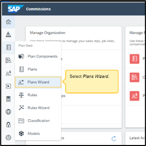
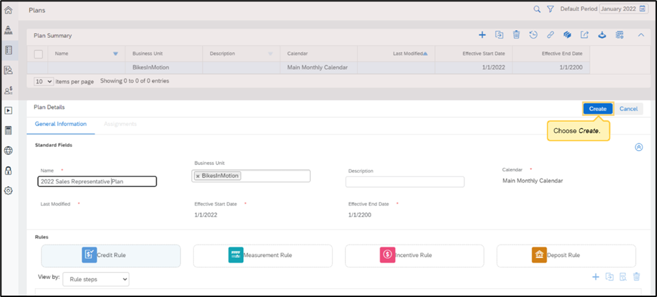
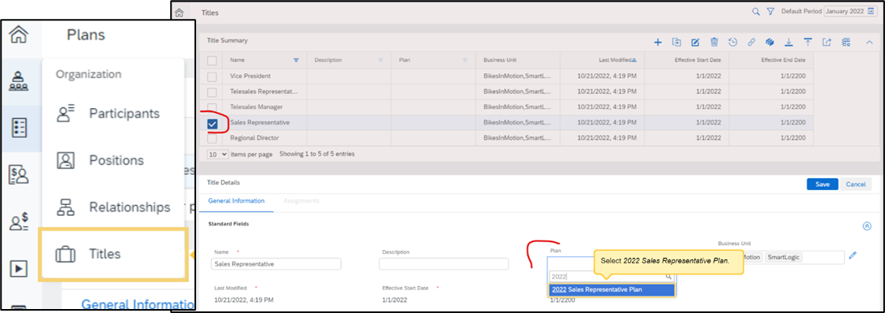

A compensation plan uses rules to determine how transactions are allocated and how incentives are calculated and paid out to the Participants.

<h1>Creating a Compensation Plan Walkthrough</h1>

<h3> 1.	Plan Data panel > Plans Wizard > + </h3>

***
<h3> 2.	Name it, assign Business Unit, create rules. </h3>

***
<h3> 3.	Go to Organization tab > Titles workspace > select the Title > Edit > Choose the Plan </h3> 
 
